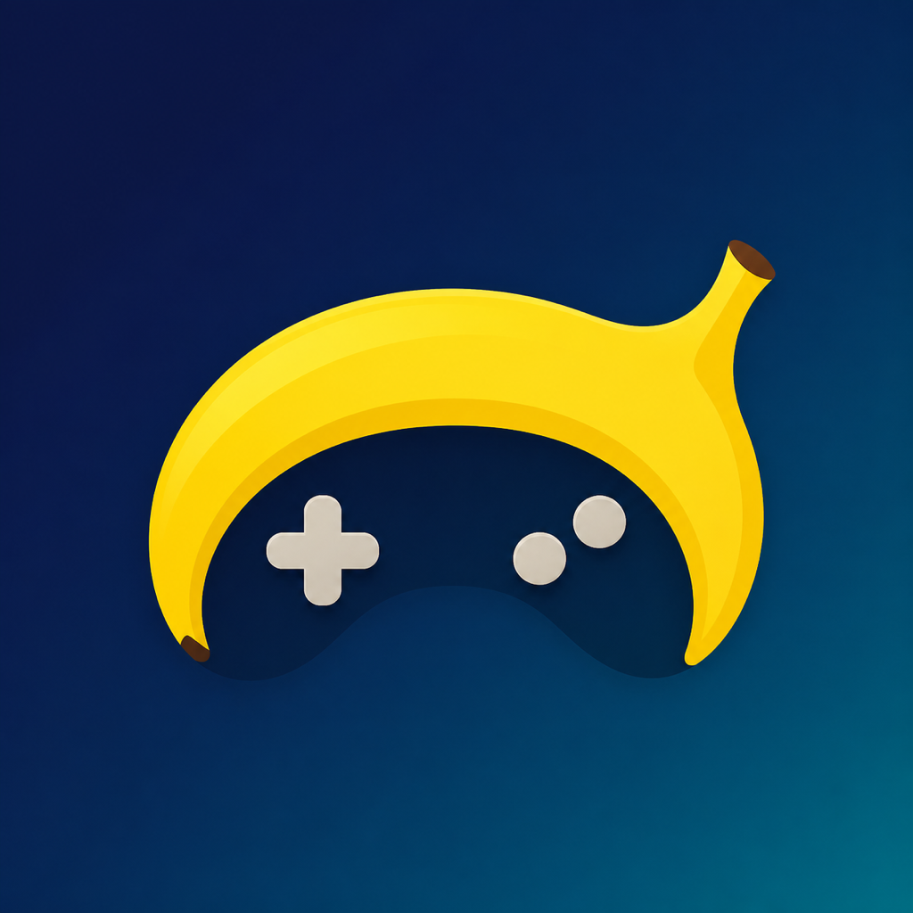
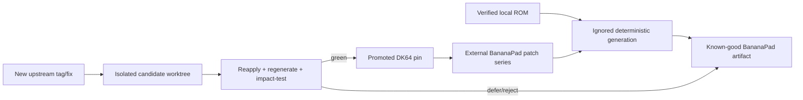

# BananaPad

<p align="center">
  
</p>

<p align="center">
  <strong>Donkey Kong 64 recompiled for Apple Silicon.</strong><br>
  Native Metal rendering, customizable iPhone and iPad controls, controller support, and private ROM import.
</p>

<p align="center">
  
  
  
  
</p>

BananaPad is an integration and hardening project built around [Donkey Kong 64: Recompiled](https://github.com/Rainchus/Donkey-Kong-64-Recompiled), N64Recomp/N64ModernRuntime, and RT64. It is intended to preserve the upstream game's static-recompilation behavior while replacing its desktop-only Apple boundary with an ahead-of-time, no-dynamic-code native shell modeled on PaperPad's proven N64/RT64 Apple work.

BananaPad is game-specific, not a general Nintendo 64 emulator. It targets only an unmodified **Donkey Kong 64 (US/NTSC-U 1.0)** ROM supplied by the user.

This repository contains integration source, patches, scripts, tests, and documentation. It does **not** contain Donkey Kong 64, a ROM, extracted Nintendo/Rare assets, generated playable game code, generated patches/RSP code, saves, or a playable ROM-derived package. Public source or binary distribution is not currently authorized; see the [rights status](docs/RIGHTS-STATUS.md).

## Project status

BananaPad has playable private macOS, iPad Simulator, and iPhone Simulator builds. Its hardened native core is accepted for boot, Metal video, audio, input, static overlays/patches, save/reload, and clean exit; the mobile-safe AOT execution model is fully inventoried and passes exact-candidate Mach-O/package audits. The exact current mobile executable independently created and visibly reloaded Game 1 on both form factors using the on-screen controls. DK64Recompiled is the accepted game implementation; BananaPad does not duplicate its full-game qualification. Remaining work is the Apple product boundary: ROM-management edge cases, controller handoff, lifecycle/orientation/memory/audio interruption behavior, hands-on multi-finger acceptance, physical-device validation, and release authorization.

| Target | Current status |
|---|---|
| Apple Silicon macOS | BananaPad direct-Metal core builds, runs DK64, accepts input, exits cleanly, and reloads a verified save |
| iPad Simulator | Exact build runs DK64 through Metal, exposes the byte-identical PaperPad touch UI/three-dot Settings menu, accepts stick/A/B/Z/R/C input, writes a save, and visibly reloads it after termination |
| iPhone Simulator | The same build fits both compact landscape safe areas, supports layout editing and lifecycle resume, accepts stick/A/B gameplay input, writes a save, and visibly reloads it |
| Physical iPad/iPhone | Requires exact-candidate hands-on acceptance by Chris |
| Public distribution | Not authorized |

The engineering bar is intentionally strict: compilation is not launch, launch is not gameplay, gameplay is not persisted progression, and Simulator evidence is not device acceptance. Follow [current status](docs/STATUS.md), the append-only [journal](docs/JOURNAL.md), and the [goal loop](docs/GOAL-LOOP.md).

## Architecture

```text
User-owned verified standard DK64 ROM
                 |
                 +--> private runtime import
                 |
                 +--> deterministic decompressor
                                |
                                v
                    ignored decompressed build ROM
                                |
                    +-----------+-----------+
                    |                       |
                 N64Recomp              RSPRecomp
                    |                       |
          ignored game + patch C/C++   ignored n_aspMain C++
                    +-----------+-----------+
                                |
                                v
             static arm64 BananaPad core + native Apple shell
                                |
                    +-----------+-----------+
                    |           |           |
                  macOS       iPadOS       iOS
```

The accepted mobile profile cannot use JIT, LiveRecomp, TCC, downloaded/user executable code, writable-executable pages, the upstream writable-text linker route, or forbidden code-signing entitlements. Required game patches are linked ahead of time or represented through writable data dispatch—not writable code.

## Reference roles

The references are pinned, ignored, push-disabled, and never edited in place:

- **DK64Recompiled** is the replaceable game source of truth. `1.0.1` is the archived initial anchor, not a permanent fork point.
- **PaperPad** is the documentation-quality and N64-on-Apple reference. Its applicable touch overlay and three-dot menu are the explicit UI source to preserve verbatim in behavior and structure, with only BananaPad naming, DK64 controls/settings, and required platform integration adapted.
- **SunPad** supplies additional lifecycle, loading, diagnostics, controller, app-identity, and acceptance mechanisms called for by the PRD.

See the exact [source map](docs/SOURCE-MAP.md) and [dependency lock](dependencies.lock.json).

## Reproducible and updateable

BananaPad keeps upstream code outside the owned integration layer:



“Easy to update” means scripted, isolated, reviewable, tested, and reversible. It does not mean auto-merging upstream `main`. Discovery, candidate staging, patch replay, regeneration, impact testing, promotion metadata, and rollback preserve the last known-good state and the immutable `1.0.1` comparison.

The normal upstream-update entry point is deliberately short:

```sh
scripts/manage-upstream.sh check
scripts/manage-upstream.sh evaluate-latest
scripts/manage-upstream.sh status
# After review and any newer-pin qualification requested by the command:
scripts/manage-upstream.sh promote
```

`evaluate-latest` is a no-op when the promoted stable tag is current. When a new stable tag exists it stages it in isolation, regenerates candidate-local inputs, builds the Apple candidate, and runs the mechanical gate without changing the working product. `status` explains whether it is green or needs the documented affected-route qualification. `rollback-candidate` recoverably rejects the staged checkout. Exact tags or selected fixes use `scripts/manage-upstream.sh evaluate TAG-OR-COMMIT [LABEL]`. This workflow has also been exercised against the actual newer upstream `main`: it regenerated and built successfully, refused to promote the untagged runtime, rolled back recoverably, and left the normal lock and Apple artifacts byte-identical. The lower-level scripts remain available for diagnosis.

Preparation regenerates the decompressed ROM, game functions, RSP code, and static patches from the isolated candidate itself. The candidate build uses those exact inputs and its own host tools. A same-pin maintenance rehearsal is deliberately non-game: clean mobile build/package audits plus exact PaperPad UI, touch/menu, ROM-management, renderer, patch-replay, and generated-input contracts are sufficient because the current runtime is already accepted. A genuinely newer pin still cannot be promoted merely because it compiles: [candidate qualification](docs/UPSTREAM-CANDIDATE-QUALIFICATION.md) requires the affected gameplay, save/reload, settings, audit, deterministic-generation, and patch-replay evidence and binds any required Simulator receipt to the exact candidate.

`scripts/rollback-upstream-update.sh --candidate` archives a rejected candidate's checkout, metadata, generated inputs, and macOS/iOS build trees together. A promoted update can be restored from the recoverable snapshot printed by the promotion command. See [upstream synchronization](docs/UPSTREAM-SYNC.md) for the required impact review and exact commands; BananaPad never follows upstream `main` unattended.

## Get started

### Requirements

Requirements currently include an Apple Silicon Mac, Xcode with the Metal Toolchain, CMake, Ninja, Git, jq, Python 3.11+, Rust/Cargo, GNU `cpp-16`, and a legally obtained supported ROM.

BananaPad accepts `.z64`, `.v64`, and `.n64` byte orders. The supported ROM normalizes to 32 MiB with SHA-1 `cf806ff2603640a748fca5026ded28802f1f4a50`. This fingerprint verifies compatibility; it is not a download hint.

Clone the private repository:

```sh
git clone https://github.com/chrissotraidis/bananapad.git
cd bananapad
```

### One-command build

From a fresh BananaPad checkout, the complete pinned-source download, private ROM preparation, deterministic generation, hardened macOS build, Simulator build, universal unsigned iPhone/iPad device build, ROM-free private IPA, no-dynamic-code checks, and package audits have one entry point:

```sh
scripts/bootstrap-bananapad.sh \
  --rom /absolute/path/to/private-original.v64 \
  --target all
```

Use `--target prepare`, `macos`, `simulator`, or `device` for a smaller endpoint (`ios` remains an alias for `simulator`; mobile targets also build the shared hardened macOS support core). `device` also creates or reuses the audited private unsigned IPA. Bootstrap never boots or launches a Simulator. It records exact source, generated-input, product, macOS, Simulator, device-app, and IPA identities in ignored `generated/validation/bootstrap-last-run.json`.

The equivalent individual steps, useful for diagnosis, are:

```sh
scripts/check-prerequisites.sh
scripts/clone-sources.sh
scripts/verify-sources.sh
scripts/build-host-tools.sh
scripts/check-repo-safety.sh
scripts/prepare-rom.sh --rom /absolute/path/to/private-original.v64
scripts/decompress-rom.sh
scripts/generate-game.sh
scripts/generate-patches.sh
scripts/build-upstream-macos-baseline.sh
scripts/build-bananapad-static-macos.sh
scripts/build-bananapad-ios-simulator.sh --build
scripts/build-bananapad-ios-device.sh
```

The device command produces one ROM-free arm64 `iphoneos` app for both iPhone and iPad at `generated/build/bananapad-ios-device/Release/BananaPad.app`. It defaults to unsigned so clean builds do not depend on one developer account. The current full-bootstrap device executable is SHA-256 `2519ee937149d35d367a0b823ac1831a37f710492c9fdcf3658119de5675c2f5`; its iPhoneOS platform, iOS 15 minimum, two device families, AOT-only executable, and package contents passed audit. The corresponding immutable private IPA is SHA-256 `8730180e8921aa25fd92b85c25444961f78ab617d8ff8ee5ee4e7d9cd6de5e9f`.

With an Apple development account already configured in Xcode, build and install a local development copy using the exact team identifier and explicit device name/UDID:

```sh
BANANAPAD_DEVELOPMENT_TEAM=YOURTEAMID \
  scripts/build-bananapad-ios-device.sh
scripts/install-bananapad-ios-device.sh DEVICE-UDID --launch
scripts/preflight-bananapad-device-acceptance.sh DEVICE-UDID --install
```

The install script refuses an invalid signature and re-runs the ROM/package audit before using `devicectl`. It does not select a device implicitly and does not package a ROM; import the user's legally obtained ROM through BananaPad's three-dot menu after launch. The preflight command additionally binds the exact signed bundle, source/lock/patch identities, and explicitly resolved device into an ignored private receipt, then creates a complete per-device G12 worksheet. It never marks hands-on acceptance as passed automatically.

For a private sideloading handoff, package the already-built unsigned app into an immutable, ROM-free IPA named by its executable hash:

```sh
scripts/package-unsigned-ipa.sh
```

The packager rejects signed input, audits both the source app and resulting IPA, and writes only under ignored `generated/packages/`. Creating this local artifact does not authorize uploading or publishing it.

To install and launch on the one booted iPhone or iPad Simulator, optionally installing a verified private ROM into that Simulator's app container:

```sh
BANANAPAD_ROM_PATH=/absolute/path/to/DonkeyKong64-US-1.0.z64 \
  scripts/build-bananapad-ios-simulator.sh --run
```

Never boot the phone and tablet Simulators together. If more than one device is available, set `BANANAPAD_SIMULATOR_UDID` to the single booted target. Installing over an existing app preserves its private ROM, save, and settings; use a new disposable Simulator or first make a recoverable app-container backup when a clean-state test is required.

To reinstall and rerun an already-built app without recompiling it, use `--smoke` with the same optional ROM and Simulator environment variables. A passing smoke waits through renderer/game initialization, writes an immutable ignored run receipt bound to the source-worktree and executable hashes under `generated/validation/ios-simulator-runs/`, and atomically refreshes the latest-run receipt. Candidate testing selects its exact immutable receipt, so a later smoke cannot overwrite its evidence.

The mobile execution-model audit follows that receipt to the exact last-passing Simulator artifact, so a staged/promoted upstream candidate is audited by default instead of an older build directory:

```sh
scripts/audit-mobile-execution-model.sh
```

All ROM-derived output stays ignored/private. Do not copy a ROM into a tracked path, run destructive cleanup, or put generated output under version control. The upstream baseline is a comparison artifact with desktop dynamic-code exceptions; it is not a BananaPad shipping build.

## First launch

BananaPad never downloads game data and no app or IPA produced by this repository contains a ROM.

1. Launch BananaPad on iPhone, iPad, or the Simulator.
2. Choose **Choose ROM** from the native setup screen.
3. Select your own supported DK64 dump in Files.
4. Wait for exact-revision validation and private byte-order normalization.
5. Start with the on-screen **Start** button or a connected input device.

Open the persistent **•••** menu, then **Settings → Manage Game ROM**, to replace or remove the private runtime copy. Replacement is validated before it becomes active. Removal requires a second confirmation and preserves saves and settings.

## Touch controls and three-dot menu

BananaPad carries PaperPad's complete iOS touch/menu/settings implementation byte for byte. That includes the persistent `•••` utility control, independent-finger N64 overlay, separate phone/tablet layouts, layout editing, controller auto-hide/handoff, modal input clearing, native volume/render/aspect/touch settings, diagnostics sharing, and ROM management. BananaPad's native SDL controller adapter now forwards attach/detach state into that exact PaperPad overlay, so a real controller can own P1 and hide gameplay touch targets without hiding the menu. The pinned source identity is executable as a regression gate:

- **Menu:** the persistent `•••` button opens settings, diagnostics, and ROM actions even when gameplay controls are hidden.
- **Touch controls:** analog stick, D-pad, A, B, Z, C-buttons, L, R, and Start support independent fingers and held-button chords.
- **Layouts:** iPhone and iPad positions persist independently; edit, link/unlink clusters, reset, scale, and opacity controls come from PaperPad.
- **Display:** Auto or fixed 1x–4x internal resolution plus Original and Fill Screen framing.
- **Input ownership:** a physical controller can own P1 and hide gameplay touch targets while leaving the utility menu available.
- **Safety:** menu, picker, alert, share sheet, lifecycle, controller, orientation, ROM, and runtime boundaries clear held input.

```sh
scripts/test-paperpad-ui-fidelity.sh
scripts/test-touch-input-contract.sh
```

The first gate protects the exact pinned UI source. The second compiles and exercises the independent per-button tap latch, verifies every N64 touch mask, multi-touch tracking, lifecycle release, controller notification/merging, and analog clamping. DK64-specific ROM setup is adapted separately. Gameplay executable `77d18de47a9e5ac6fb0239d6703aba5f8048a34826c12f60c2271e272b0bb3fd` passed locked-ROM smoke and interactive touch acceptance on both targets; its full tablet and compact phone overlays were directly inspected, including the persistent three-dot menu. On each target, touch Start/A created Game 1 and reached DK's treehouse, touch-stick input moved DK, A jumped, B attacked, a 2,048-byte save was written, and terminate/relaunch visibly restored `0% / 000 / 00:04`. The runtime-identical original-icon package, executable `f4fab84e2b0b99c8cba45ccfd576f256810eebd660f25fbf00805564b910f182`, then passed fresh locked-ROM smokes and visual overlay/menu inspection on iPad and iPhone. On iPad, Z crouch, R recenter, all four original C-camera directions, touch swimming, and lifecycle input clearing are game-visible. Physical-device acceptance still requires simultaneous Z+A, Z+B, and Z+C-direction chords plus real-controller connect/disconnect; Simulator automation cannot honestly replace those hands-on checks. A future Analog Camera touch mode must not steal the baseline C controls.

The current mobile-shell delta, executable `739fecd9aed836bf235c15ddfac2f80b50babd88fe4850e410e4d79524505117`, was inspected on one iPad Simulator. The exact full touch overlay and persistent three-dot menu remain present; Settings, layout controls, diagnostics, and Manage Game ROM were accepted on the immediately preceding byte-identical UI build. The current executable also completed three Home→foreground cycles, retained the open menu and native Settings across transitions, restored the complete touch overlay after dismissal, resumed renderer output, rendered both landscapes, and survived three clean terminate/relaunch initialization cycles without a new crash report. Replacement validates completely before atomic installation. Removal requires a second confirmation, says that saves/settings remain, and deletes only BananaPad's private ROM/config. Native UIKit presentation and app deactivation suppress both physical-controller buttons and right analog in the game adapter, and held controller state cannot resume until every control returns to neutral. The compiled path is verified, while a real controller remains a physical-device acceptance check.

The clean upstream replay is bound to patch-series SHA-256 `8f9e051ed2d643a39a4618acd0c31f3072317732bd29ade1a8687256e91b9505`, candidate-worktree SHA-256 `d1bbe0dd4c04a8a793648cdcdc4b690064f9e725418211c06326c1eb1c896a70`, and product-source SHA-256 `d7e4873026331e89acbee9e30d91f5daf5b5de8023b011650f040783040fc0cb`. Candidate-local game, patch, and decompressed-ROM identities are regenerated and verified before the build. The same-pin stage/regenerate/build/UI-contract/package-audit/promote/rollback lane passes without launching DK64, so later DK64Recompiled releases can be evaluated without rewriting or overwriting the Apple shell; genuinely newer runtime changes still receive affected-route qualification.

Every native menu, picker, alert, share sheet, controller transition, interruption, orientation change, background transition, ROM change, and runtime stop must clear held input. A visually copied overlay without those semantics does not pass.

BananaPad also ships original project-owned icon artwork: a generic banana curve integrated with a neutral controller motif, without game art, characters, screenshots, or third-party marks. Its editable-generation master, selected asset hash, prompt, processing history, and exclusions are recorded in the app-icon provenance file and guarded by `scripts/test-app-icon-contract.sh`.

## What works

| Area | Current implementation |
|---|---|
| Native code | Static arm64 DK64 game, patch, overlay, and RSP code on Apple targets; no JIT or downloaded executable code |
| Rendering | RT64 presentation through Metal with Retina drawable sizing and original/fill framing |
| Game setup | Native three-byte-order ROM selection, exact US 1.0 validation, atomic replacement, removal, and private storage |
| Touch | Full PaperPad N64 overlay, multi-touch, phone/tablet layouts, editing, reset, opacity, and persistent three-dot menu |
| Input | macOS keyboard/controller bridge plus iOS touch and SDL physical-controller ownership paths |
| Saves | 2,048-byte EEPROM creation and visible terminate/relaunch reload verified independently on iPad and iPhone Simulators |
| Lifecycle | Held-input clearing, native-UI suppression, neutral rearm, repeated foreground return, and both landscape orientations |
| Packaging | ROM-free macOS, Simulator, universal iPhoneOS app, unsigned IPA, AOT, Mach-O, privacy, and package audits |
| Updates | Isolated DK64Recompiled staging, patch replay, deterministic regeneration, impact gates, promotion, and recoverable rollback |

## Supported game

| Game | Revision | Status |
|---|---|---|
| **Donkey Kong 64** | US / NTSC-U 1.0 | Supported input for private builds and runtime import |
| Donkey Kong 64 | Japan, PAL, kiosk, modified, or randomized ROMs | Not supported by the current configuration |
| Other Nintendo 64 games | Any | Not supported; BananaPad is not a general emulator |

## Diagnostics and bug reports

Open **••• → Share Diagnostics & Logs…** immediately after reproducing a problem. The bounded report includes app/build, system, screen, settings, renderer, and current/previous runtime-log context. It records only whether compatible game data is present—never ROM or save contents—and redacts known app-container, home, and temporary paths.

Review every report before sharing it: arbitrary runtime text is not guaranteed to be anonymous. Include the BananaPad revision, device and OS, exact reproduction steps, expected and observed behavior, and a screenshot for visual defects. Never attach ROMs, extracted assets, generated playable code, saves, signing files, credentials, or private device data.

For a physical iPhone or iPad pass, create an exact artifact-bound receipt and worksheet first:

```sh
scripts/preflight-bananapad-device-acceptance.sh DEVICE-UDID --install
```

## Frequently asked questions

<details>
<summary><strong>Does BananaPad include Donkey Kong 64?</strong></summary>

No. You must supply your own legally obtained, unmodified Donkey Kong 64 (US 1.0) ROM. BananaPad never downloads game data and rejects unsupported revisions.
</details>

<details>
<summary><strong>Does the game actually run on iPhone and iPad?</strong></summary>

Yes in both iPhone and iPad Simulators: the native Metal build reached gameplay through touch, wrote a save, terminated, relaunched, and visibly restored it. The universal physical-device target also builds and audits. Signed hardware acceptance remains separate because this Mac currently has no connected device or Apple signing identity.
</details>

<details>
<summary><strong>Are the touch controls the PaperPad controls?</strong></summary>

Yes. The pinned PaperPad `ios_main.mm`, including the complete touch/settings implementation and persistent three-dot menu, is byte-identical in BananaPad. An automated fidelity gate protects that exact source identity.
</details>

<details>
<summary><strong>How are future DK64Recompiled updates handled?</strong></summary>

`scripts/manage-upstream.sh evaluate-latest` stages the new upstream version in isolation, reapplies BananaPad's external patch series, regenerates candidate-local game inputs, builds and audits it, and refuses promotion until the affected qualification is complete. Rejection archives every candidate input and build tree; the last known-good product remains untouched.
</details>

<details>
<summary><strong>Can I publish the source or IPA?</strong></summary>

Not from the current project state. The repository is private, the IPA is a private ROM-free artifact, and [rights status](docs/RIGHTS-STATUS.md) plus physical G12 acceptance remain explicit release gates.
</details>

## Documentation

- [Product requirements](docs/PRD.md)
- [Autonomous goal loop](docs/GOAL-LOOP.md)
- [Current status](docs/STATUS.md)
- [Engineering journal](docs/JOURNAL.md)
- [Dependencies](docs/DEPENDENCIES.md)
- [Archived upstream baseline contract](docs/UPSTREAM-BASELINE.md)
- [G3 mobile execution-model validation](docs/VALIDATION-G3-2026-08-31.md)
- [AOT game and patch model](docs/AOT-AND-PATCHES.md)
- [Compressed overlays](docs/OVERLAYS.md)
- [RSP and audio path](docs/RSP.md)
- [Save and accessories](docs/SAVE-AND-ACCESSORIES.md)
- [G2 hands-on comparison validation](docs/G2-HANDS-ON.md)
- [Apple touch and Simulator validation](docs/VALIDATION-APPLE-TOUCH-2026-09-01.md)
- [Physical iPhone/iPad acceptance checklist](docs/DEVICE-ACCEPTANCE.md)
- [Release readiness and PRD matrix](docs/RELEASE-READINESS.md)
- [Upstream synchronization](docs/UPSTREAM-SYNC.md)
- [New upstream candidate qualification](docs/UPSTREAM-CANDIDATE-QUALIFICATION.md)
- [Source map and reference ownership](docs/SOURCE-MAP.md)
- [Rights and publication state](docs/RIGHTS-STATUS.md)

## Legal

BananaPad is an independent, unofficial project and is not affiliated with or endorsed by Nintendo, Rare, Microsoft, or any upstream project. Donkey Kong 64 and related names, characters, copyrights, and trademarks belong to their respective owners. Users must supply their own legally obtained supported ROM. Source-license compliance, ROM exclusion, and a ROM-free package do not automatically grant translated-binary distribution rights.
